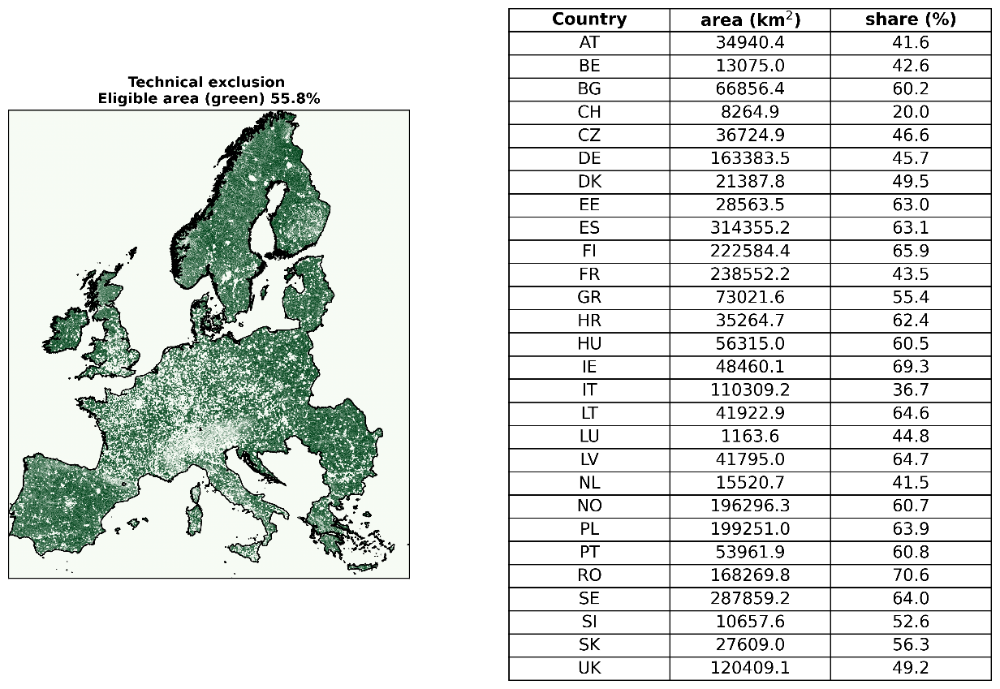

# Technical exclusions for Europe

This sub-repository generates the technical exclusion used in highRES-Europe. The particular application presented here is based on the work in the Horizon 2020 project [WIMBY](https://wimby.eu/) and is include in a forthcoming publication. 

The Snakemake based workflow process highly detailed geospatial data, applies buffer distances to different type of infrastructure and produce a raster file with the combined technical exclusions. The raster file is later used in the [highRES-Europe Workflow](https://github.com/highRES-model/highRES-Europe-WF/) to determine the wind energy potential across different regions in Europe. 

The workflow is customisable and can be modified to include additional/alternative data sources as well as different buffer distances. 

<p align="center">
    
</p>
The figure above shows the resulting technical exclusions and how much land area is available for wind energy deployment (based on technical aspects only). 

Datasets:
* [Eurostat shapefiles](https://ec.europa.eu/eurostat/web/gisco/geodata/statistical-units/territorial-units-statistics), used as the base layer for specifying the spatial extent. 
* [EU-Hydro River Network Database 2006-2012 (vector), Europe](https://land.copernicus.eu/en/products/eu-hydro/eu-hydro-river-network-database), used to exclude hydrological features.
* [Copernicus DEM – GLO-90](https://doi.org/10.5270/ESA-c5d3d65), used to generate the maximum slope restrictions. 
* [EMODnet Human Activities, Vessel Density Map](https://emodnet.ec.europa.eu/en/human-activities), used to exclude shipping lanes.
* [Open Street Map](https://www.openstreetmap.org/), used to 

## Installation and usage

The workflow is built using the Python based workflow manager [Snakemake](https://snakemake.github.io/). 

1. Clone the repository:
```sh
git clone git@github.com:highRES-model/highRES-Europe-PreProc-WF.git
```

2. Install Snakemake and the associated conda environment. The recommended way is using [mamba](https://mamba.readthedocs.io/en/latest/installation.html) to install snakemake into its own conda environment from the environment file:
```sh
mamba env create -f workflow/envs/technical_exclusions.yaml`
```

3. Acquire the data (see links in the description above) and setup the paths and potential modifications to the buffer distances in the config file.

4. Activate the environment `conda activate technical_exclusions` and run the workflow: `snakemake -c 1 --configfile config/config.yaml`.

## Computational requirements

Due to the high resolution GIS data and relatively large extent, the code in this repository requires considerable computational resources. Running the workflow requires about 30GB och memory, primarily due to `rule build_techExclusions` and the processing of the European road network. 

The code has been tested for the following system:

    Linux : Ubuntu 24.04
