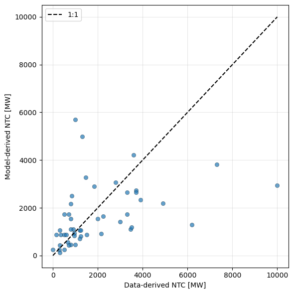

# Flexible transmission network

This repository contains code used to generate a transmission network, adapted for use with [highRES-Europe](https://github.com/highRES-model/highRES-Europe-WF). 

In short, the code uses open-source data of transmission lines and links to build a transmission network at a specified spatial resolution and extent. 

## Description
The workflow is meant to be flexible, and should be able to handle custom zones and regions of interest. The user provide the regions of interest (e.g. NUTS2/NUTS3) to the workflow, which proceeds to look up the lines in the datasets and see which zones they are connected to. If a link is within only one zone (so e.g. SE31 > SE31) it is dropped, and if it is connected between two different zones (e.g. SE31 > SE21) it is kept. 

We distinguish between overhead transmission **lines** and subsea transmission **links**. The latter is easier to model as data is in transfer capacity (MW). The existing lines on the other hand are in apparent power (MVA) and need to be processed to transfer capacity. We do this using a derating factor, based on a comparison between publicly available transfer capacity data and the apparent power from [Xiong et al. (2025)](https://www.nature.com/articles/s41597-025-04550-7). This will be published together with this code shortly. Contact oskar.vagero@its.uio.no if you need it prior to that. In short, we fit the derating factor by least squares. This results in a factor of 0.2543, and a comparison between the modelled (y-axis) and data-based (x-axis) transfer capacity is shown in the figure below. 

<p align="center">
    
</p>

The workflow further considers existing high-voltage transmission lines, planned new lines or upgrades to existing lines according to ENTSO-E's Ten-Year Network Development Plan (TYNDP).

The main output of the workflow is ``trans.dd'', which contains the information necessary for the transmission module of highRES-Europe. It defines the (currently) two types of transmission, high-voltage AC overhead lines (HVAC_OHL) and high-voltage DC Marine Interconnectors (HVDC_MarineIC), the lines/links, their distance as well as current and planned transfer capacities. 

The workflow also produces a diagnostics file with any dropped lines which was not possible to process in ``dropped_lines.csv''. If relevant, these need to be manually processed. 

## Data sources
* Data on existing transmission lines (down to 220kV) and links is based on OpenStreetMap data processed and published by [Xiong et al. (2025)](https://www.nature.com/articles/s41597-025-04550-7). The data is published on [Zenodo](https://zenodo.org/records/18619025) under an [ODC Open Database License v1.0](https://opendatacommons.org/licenses/odbl/1-0/).
* Data on planned new/upgraded transmission lines and links requires a combination of data from [PyPSA-Eur](https://github.com/PyPSA/pypsa-eur/tree/23c2fac7299905e7d0ee91d03dac16ffe7bd5d24/data/transmission_projects/tyndp2020) for the extracted coordinates of lines/links and [ENTSO-E's TYNDP Project Sheets](https://tyndp2020-project-platform.azurewebsites.net/projectsheets/transmission) for capacity data for said links. 
* Data on existing transmission lines and transmission params are from the technoeconomic database file from [highRES-Europe](https://github.com/highRES-model/highRES-Europe-WF). 


## Installation and usage

The workflow is built using the Python based workflow manager [Snakemake](https://snakemake.github.io/). 

1. Clone the repository:
```sh
git clone git@github.com:highRES-model/highRES-Europe-PreProc-WF.git
```

2. Install Snakemake and the associated conda environment. The recommended way is using [mamba](https://mamba.readthedocs.io/en/latest/installation.html) to install snakemake into its own conda environment from the environment file:
```sh
mamba env create -f workflow/envs/transmission_network.yaml
```

3. Acquire the data (see links in the description above) and setup the paths and potential modifications in the config file.

4. Activate the environment `conda activate transmission_network` and run the workflow: `snakemake -c 1 --configfile config/config.yaml`.

## Computational requirements

The code consumes negligible computational resources and should be possible to run on any machine. 

The code has been tested for the following system:

    Linux : Ubuntu 24.04
